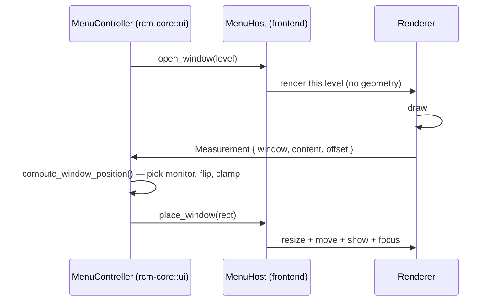

# rcm-reactor

A reimplementation of the `rcm-tauri` RCM context-menu engine using:

- **[`windows-reactor`](../../windows-rs/crates/libs/reactor)** — declarative WinUI 3 UI in Rust
  (replaces the Tauri/WebView + React frontend)
- **[`tray-icon`](https://crates.io/crates/tray-icon)** — system tray (replaces `tauri`'s tray)
- **[`windows`](https://crates.io/crates/windows)** — the little Win32 needed to make Reactor
  windows behave like native popup menus (positioning, borderless chrome, borders)

All system behaviour is shared with the Tauri build through the existing workspace crates
`rcm-core`, `rcm-vm`, `rcm-com` and `rcm-reg`.

```sh
cargo run -p rcm-reactor
```

## Feature parity with `rcm-tauri`

| Tauri feature                                                                                                                                                                   | rcm-reactor equivalent                                                            |
| ------------------------------------------------------------------------------------------------------------------------------------------------------------------------------- | --------------------------------------------------------------------------------- |
| `monitor.rs` — `rcm_com` pipe listener + filters + `rcm-vm::from_info`                                                                                                          | `monitor.rs` (same logic, pushes cross-thread events)                             |
| `pipe.rs` — single-instance check                                                                                                                                               | `main.rs::is_rcm_process_running` (verbatim)                                      |
| `tray.rs` — tray icon, style/register/blocking/dev/icons/theme/autostart/pull/reset/apply/quit                                                                                  | `tray.rs` using `tray-icon` + `muda`                                              |
| WebView menu windows (`main` + `submenu-0..2`)                                                                                                                                  | One Reactor popup per nesting level, opened with `open_window`                    |
| `layout.rs` — `MenuManager` show/hide/hover/execute/blur/auto-hide                                                                                                              | `state.rs` (window registry, deepest depth, auto-hide) + `app.rs` (`handle_idle`) |
| `events.rs` — payloads + window labels                                                                                                                                          | `events.rs` (cross-thread queue) + `state.rs`                                     |
| `MenuShowPayload` / `MenuHoverPayload` / `MenuExecutePayload` / `MenuBlurPayload`                                                                                               | Folded away — menu levels are native windows driven by pointer events             |
| `get_config`, `get_style_css`                                                                                                                                                   | Read directly from `rcm-core::config` / `style.rs`                                |
| `read_config_file`, `save_config_file`, `open_in_editor`                                                                                                                        | `config_editor.rs`                                                                |
| `notify_style_updated`, `pull_js`, `pull_css`, `pull_config`                                                                                                                    | Tray "Pull" + config editor                                                       |
| `show_error` / `run_error`                                                                                                                                                      | `error_window.rs`                                                                 |
| `create_window` (lazy submenu creation)                                                                                                                                         | Not needed — levels are created on hover                                          |
| Reactor UI components (`App`, `ContextMenu`, `MenuItemRow`, `IconRibbon`, `MenuGroup`, `MenuSeparator`, `SubmenuApp`, `ConfigEditor`, `ErrorPage`, `useMenuWindow`, `useTheme`) | `menu_window.rs`, `config_editor.rs`, `error_window.rs`, `app.rs`                 |

## Deliberately out of scope

These depend on WebView/CSS features WinUI does not have, and are only kept so the files
around them stay compatible:

- **`style.css`** — Reactor renders native WinUI controls, so the stylesheet no longer affects
  the UI. It is still written next to the executable and can still be pulled/edited so the
  config-editor and remote-sync workflow is unchanged.
- **Custom CSS layout / padding variables** — replaced by fixed metrics
  (`metrics.padding`, `metrics.row_height`, …) in `rcm_core::ui::MenuMetrics`.
- **Animations / transitions** — not ported.
- **WebView2 warm-up window** (`_warmup`) — no WebView in this build.

## Architecture

### Who decides what

Rust owns every layout decision; the frontend draws and measures.

| Concern                                      | Owner          |
| -------------------------------------------- | -------------- |
| Which level is displayed                     | `rcm_core::ui` |
| Where each window goes (clamp, flip)         | `rcm_core::ui` |
| Hover / blur / auto-hide policy              | `rcm_core::ui` |
| Drawing a level                              | frontend       |
| Measuring the drawn content                  | frontend       |
| Moving / resizing / focusing a native window | frontend       |

The frontend's only geometry output is a `Measurement` — how large it drew a
level. It never computes a position, and Rust never sends one.

### Two-phase host contract

`MenuHost` splits showing a level into two steps, which is what lets Rust own
placement while the frontend owns drawing and measuring:

1. **`open_window`** — create or reuse the window and tell the frontend to render
   the level. _No geometry applied._
2. **`place_window`** — apply the final rectangle, reveal and focus.

In between, the frontend measures and reports:



Both frontends implement the same contract:

|                 | Reactor                           | Tauri                         |
| --------------- | --------------------------------- | ----------------------------- |
| `MenuHost` impl | `menu_runtime.rs` (`ReactorHost`) | `menu_host.rs` (`TauriHost`)  |
| `Window` key    | `HWND` (`isize`)                  | window label (`&'static str`) |
| Render event    | component `open_window`           | `menu-show` emit              |
| Measurement     | `observe_composition_host`        | `menu-measured` emit          |

Both run the _same_ `MenuController`, so the two builds place menus identically.

### Reactor: measurement

Reactor has no general measurement API, but `observe_composition_host` on an
`ElementRef<Grid>` reports the bound grid's real `ActualWidth` / `ActualHeight`
and re-reports on every WinUI `SizeChanged`
(`CompositionHostEvent::Ready | Metrics`). That gives the laid-out content size.

- The root grid is `HorizontalAlignment::Left` / `VerticalAlignment::Top` with a
  width clamp, so the grid's width _is_ the menu's natural width.
- Row grids use an `Auto` label column plus an empty `Star` spacer before the
  arrow: `Auto` keeps the measurable natural width, and the `Star` absorbs the
  slack once the window matches it, pinning the arrow right.
- Only the **first** measurement is applied — resizing emits another `Metrics`,
  which would otherwise oscillate.
- `win32.rs` applies the position always, and the size only once measured;
  before that the framework owns the size (`client_size` is in DIPs).

> **Caveat:** `observe_composition_host` is documented as observing an
> _application-owned lifted Composition host_, not as general layout measurement.
> It works because it reports `IFrameworkElement` metrics, but that can change
> without notice. The estimate from `MenuMetrics` is used if no measurement
> arrives, so the menu still opens either way.

## Architecture (process view)

### Shared layout core (`rcm-core::ui`)

All layout intelligence lives in `rcm-core::ui` so both frontends behave the same:

| Module       | Responsibility                                                                                         |
| ------------ | ------------------------------------------------------------------------------------------------------ |
| `geometry`   | `Point` / `Size` / `Rect` in physical pixels                                                           |
| `metrics`    | `MenuMetrics` — gaps, auto-hide, depth limit, row presentation                                         |
| `level`      | `MenuLevel::flatten` — menu tree → ordered renderable rows                                             |
| `position`   | `compute_window_position` — monitor pick, flip, clamp                                                  |
| `state`      | `MenuState` — open windows, deepest depth, blur debounce, idle                                         |
| `controller` | `MenuController` — owns the open levels, their rectangles, and the show/hover/place/hide state machine |
| `host`       | `MenuHost`, `Measurement`, `Placement` — the trait a toolkit implements                                |
| `blocking`   | cached native menu-blocking flag                                                                       |

`MenuController` also **stores each level's placed rectangle**, so a submenu's
position is derived from the parent's real rectangle rather than from anything a
frontend reported. The hover payload is correspondingly tiny: depth, path, row
index, and the row's offset.

### Shared behaviour outside the layout (`rcm-core`)

Layout was not the only duplicated code. These modules are the _system_ half,
used by both frontends:

| Module                   | What it removes                                                                                                                                          |
| ------------------------ | -------------------------------------------------------------------------------------------------------------------------------------------------------- |
| `actions`                | Tray/menu actions: style, register, blocking, icons, dev, theme, autostart, pull, reset, apply, quit, plus the shared tray `ids` and `text` label tables |
| `files`                  | Config-editor allow-list, read/save/open, and the identical error strings                                                                                |
| `style`                  | Embedded `style.css`, `write_style_defaults`, cached `load_style_css`                                                                                    |
| `process`                | `is_rcm_process_running` (was duplicated verbatim in two `pipe`/`main` files)                                                                            |
| `config::ignore_reason`  | Event filter matching and its log message                                                                                                                |
| `runner::execute_logged` | Execute-a-command-and-log-the-failure helper                                                                                                             |
| `ui::blocking`           | The blocking flag and its fallback cache                                                                                                                 |

`actions` is the biggest win: each tray entry's _behaviour_ is shared, and only
the presentation differs — Tauri ticks a `tauri::menu::CheckMenuItem` and emits
an app event, Reactor ticks a `muda::CheckMenuItem` and pushes an in-process
event. The functions return the new state (`toggle_icons() -> bool`) so neither
frontend re-derives it.

### Why Win32 is still used

Reactor creates plain top-level WinUI windows; it exposes neither window position nor window
visibility. The context menu needs a borderless, always-on-top popup at the cursor, so
`win32.rs` applies `WS_POPUP`, clears the caption, sets `WS_EX_TOOLWINDOW | WS_EX_TOPMOST`, and
calls `SetWindowPos` / `PostMessageW(WM_CLOSE)`. Everything else is pure Reactor.

It is also where the popup is made the **foreground window**. The right-click is captured inside
Explorer by the shell extension and forwarded to us over a pipe, so our process never received
the input event Windows requires before it honours `SetForegroundWindow`. `force_foreground`
temporarily attaches our input queue to the current foreground thread
(`AttachThreadInput`) to lift that restriction. Once the popup is active, clicking anywhere else
gives a real blur, which is what dismisses the menu like the native one.

Dismissal waits for the foreground to be "not ours" on two consecutive polls, because a parent
popup briefly loses activation while handing it to the submenu it just opened.

### Hover highlight

Each row is a `Border` with a non-null (transparent) `Background` — WinUI requires that for the
element to take part in hit testing — and the row under the pointer swaps to a translucent
neutral grey (`MENU_HOVER_ARGB`). A neutral grey reads as a highlight on both light and dark
menu surfaces, unlike WinUI's `CardStroke`, which is nearly invisible on dark.

### Row metrics

A menu row is laid out as `MENU_PADDING + MENU_ROW_PAD_X.0` before the label:
`4 + 4 = 8 px`. The icon gutter (`MENU_ICON_W`) is only reserved when `icons` is enabled _and_
at least one row in that level actually carries an icon — see `MenuWindow::shows_icons`. The
gutter is decided per menu level rather than per row so labels stay aligned within a level,
and is skipped entirely otherwise, because the icon ribbon is off by default and the reserved
strip would just be dead space.

### Popup lifecycle

1. `monitor.rs` receives a right-click, builds the menu with `rcm-vm`, and pushes
   `AppEvent::ShowMenu`.
2. `RcmApp` drains the queue on a timer and calls `menu_runtime::show_root`, which asks
   the controller for the level and then opens it via `ComponentContext::open_window`.
3. `MenuWindow` schedules a one-shot `ComponentTimer` (the returned handle is stored —
   dropping a `ComponentTimer` cancels it) which calls `run_window` to hand its `HWND` to
   the controller and place it at the estimated size.
4. The renderer reports its real size; the controller re-clamps with it and Reactor applies
   the final rectangle and focuses the window.
5. Hovering a row with children reports the row to the controller, which positions the child
   from the parent's stored rectangle; clicking a leaf runs the command via
   `rcm_core::runner::execute`.
6. `RcmApp` polls on a timer: if the foreground window is no longer one of our popups (and at
   least one has been focused), the controller closes them all; otherwise, after 30 s without
   interaction, the auto-hide timeout does the same.
